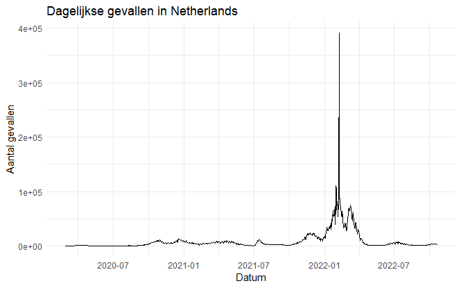

# R Package 

Hier heb ik een R-pakket gemaakt genaamd CovidPackage. Dit pakket is ontwikkeld om te assisteren bij de analyse van COVID-19-gegevens. Elke functie binnen dit pakket heeft een specifieke rol bij het verwerken, analyseren of visualiseren van informatie die gerelateerd is aan COVID-19.

En die R package kun je zien in mijn githup [github](https://github.com/Fatimadanawar/CovidPackage).

```{r, eval=FALSE}
# install.packages("devtools")
devtools::install_github("Fatimadanawar/CovidPackage", build_vignettes = TRUE)
```

Hier is een voorbeeld van een functie binnen deze R package.

```{r, eval=FALSE}
CovidPackage::plot_dagelijkse_gevallen(data_covid, "Netherlands")
```


